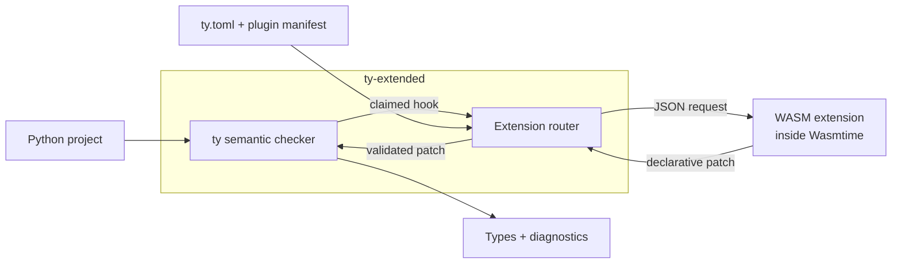

# ty-extended

[](https://pypi.org/project/ty-extended/)

[ty-extended](https://pypi.org/project/ty-extended/) is
[Astral's ty](https://github.com/astral-sh/ty) with a sandboxed semantic extension system. It keeps
the `ty` command and language server while allowing libraries to contribute library-aware types
and diagnostics without linking to checker internals.

## Extension showcase

[`django-ty`](https://github.com/regularkevvv/django-ty) is a live extension for Django ORM
semantics, available now from [PyPI](https://pypi.org/project/django-ty/). It covers model fields,
relations, managers, querysets, lookups, settings, forms, and requests, with its behavior measured
against `django-stubs` in a reproducible differential-conformance suite.

## What ships

| Distribution         | Published at                                                                                             | Purpose                                                                                                                                                   |
| -------------------- | -------------------------------------------------------------------------------------------------------- | --------------------------------------------------------------------------------------------------------------------------------------------------------- |
| `ty-extended`        | [PyPI](https://pypi.org/project/ty-extended/)                                                            | The `ty` checker and language server with semantic extension loading and WASM execution.                                                                  |
| `ty_plugin_sdk`      | [crates.io](https://crates.io/crates/ty_plugin_sdk) · [docs.rs](https://docs.rs/ty_plugin_sdk)           | The Rust API used to [build an extension](./docs/extension-authoring.md): manifest builders, typed hooks, patch helpers, JSON dispatch, and WASM exports. |
| `ty_plugin_protocol` | [crates.io](https://crates.io/crates/ty_plugin_protocol) · [docs.rs](https://docs.rs/ty_plugin_protocol) | The stable serialized manifest, request, response, claim, and patch types shared by extensions and the host.                                              |

Most extension authors only need `ty_plugin_sdk`; it re-exports the protocol crate as
`ty_plugin_sdk::protocol`. The Rust implementation lives in the [`ruff` submodule](./ruff), backed
by [ruff-extended](https://github.com/regularkevvv/ruff-extended).

## How extensions run



The manifest tells ty which symbols and hooks an extension owns. At a matching semantic query,
ty serializes a small request, executes the extension inside a Wasmtime sandbox, validates the
returned patch, and feeds the result back into type inference. Extensions receive protocol data,
not ty's internal types, AST ids, or Salsa database.

## Getting started

Run the checker directly with [uvx](https://docs.astral.sh/uv/guides/tools/#running-tools):

```shell
uvx --from ty-extended ty check
```

Or add it to a project:

```shell
uv add --dev ty-extended
uv run ty check
```

See [installation](./docs/installation.md), [type checking](./docs/type-checking.md), and
[editor integration](https://docs.astral.sh/ty/editors/) for the regular ty workflow.

## Configure extensions

An installed extension package can be discovered from the project's Python environment:

```toml
# ty.toml
[plugins]
auto-discover = true
```

To load a WASM artifact explicitly, configure and trust it for the project:

```toml
# ty.toml
[plugins]
enabled = true

[[plugins.plugin]]
id = "my-extension"
path = ".ty/plugins/my_extension.wasm"
runtime = "wasm"
manifest-path = ".ty/plugins/my-extension.plugin.json"
trusted = true
```

Use `[tool.ty.plugins]` and `[[tool.ty.plugins.plugin]]` for the same settings in
`pyproject.toml`. See [extension runtime](./docs/extension-runtime.md) for loading, trust, and
sandbox details.

## Everything from ty

ty-extended tracks ty's checker and language server. That includes:

- fast incremental type checking;
- rich diagnostics and configurable rule levels;
- gradual typing, advanced narrowing, and intersection types;
- editor support for navigation, completion, code actions, auto-imports, inlay hints, and hover;
- the same `ty check`, `ty server`, configuration, and project discovery behavior.

The [upstream ty documentation](https://docs.astral.sh/ty/) remains the reference for those shared
features.

## Documentation

- [Build a semantic extension](./docs/extension-authoring.md)
- [Understand the host runtime](./docs/extension-runtime.md)
- [Read the ty-extended FAQ](./docs/faq.md)
- [Browse the full ty-extended documentation](./docs/index.md)

## FAQ

### Is ty-extended a separate checker?

It is a fork of ty that preserves the `ty` CLI and language server and adds semantic extensions.

### Why does it execute extensions as WASM?

WASM gives extensions a stable, serialized boundary and lets the host enforce deterministic fuel,
memory, and response-size limits without exposing checker internals or ambient system access.

### Where are general ty questions answered?

See [ty's upstream typing FAQ](https://docs.astral.sh/ty/reference/typing-faq/). The
[ty-extended FAQ](./docs/faq.md) covers only fork and extension behavior.

## Getting help

For ty-extended packaging, extension runtime, SDK, or protocol issues, open an
[issue](https://github.com/regularkevvv/ty-extended/issues). For behavior inherited unchanged from
ty, check the [upstream documentation](https://docs.astral.sh/ty/) first.

## Contributing

Most implementation work happens in the `ruff` submodule, which points at
[regularkevvv/ruff-extended](https://github.com/regularkevvv/ruff-extended). See the
[contributing guide](./CONTRIBUTING.md) for the repository workflow.

## Version policy

ty-extended uses SemVer-compatible fork versioning that records the upstream ty base:

- upstream `0.0.58` maps to the initial `ty-extended 0.58.0` release;
- later fork releases on the same upstream base increment the patch, such as `0.58.1` and `0.58.2`;
- upstream `0.0.59` maps to `ty-extended 0.59.0`;
- later releases on that base increment the patch, such as `ty-extended 0.59.1`;
- upstream `0.1.50` maps to `ty-extended 0.150.0`;
- once upstream reaches `1.0.0`, ty-extended follows that shape directly as `1.0.x`.

The protocol and SDK crates are versioned independently. They are pre-1.0, so breaking changes may
occur between any two `0.0.x` releases.

## License

ty is licensed under the MIT license ([LICENSE](LICENSE) or
<https://opensource.org/licenses/MIT>).

Unless you explicitly state otherwise, any contribution intentionally submitted for inclusion in
ty by you, as defined in the MIT license, shall be licensed as above, without any additional terms
or conditions.
