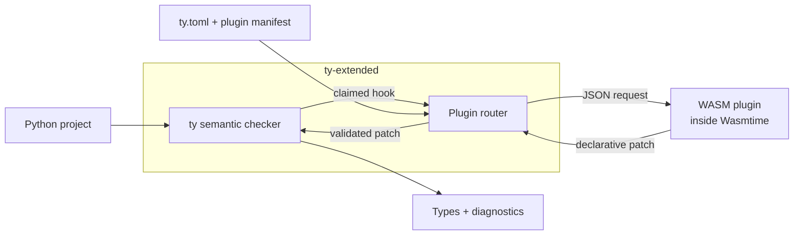

# ty-extended

[](https://pypi.org/project/ty-extended/)

[ty-extended](https://pypi.org/project/ty-extended/) is
[Astral's ty](https://github.com/astral-sh/ty) with a sandboxed semantic plugin system. It keeps
the `ty` command and language server while allowing libraries to contribute library-aware types
and diagnostics without linking to checker internals.

## Plugin showcase

[`django-ty`](https://github.com/regularkevvv/django-ty) is a live plugin for Django ORM
semantics, available now from [PyPI](https://pypi.org/project/django-ty/). It covers model fields,
relations, managers, querysets, lookups, settings, forms, and requests, with its behavior measured
against `django-stubs` in a reproducible differential-conformance suite.

## What ships

| Distribution         | Published at                                                                                             | Purpose                                                                                                                                            |
| -------------------- | -------------------------------------------------------------------------------------------------------- | -------------------------------------------------------------------------------------------------------------------------------------------------- |
| `ty-extended`        | [PyPI](https://pypi.org/project/ty-extended/)                                                            | The `ty` checker and language server with semantic plugin loading and WASM execution.                                                              |
| `ty_plugin_sdk`      | [crates.io](https://crates.io/crates/ty_plugin_sdk) · [docs.rs](https://docs.rs/ty_plugin_sdk)           | The Rust API used to [build a plugin](./docs/plugin-authoring.md): manifest builders, typed hooks, patch helpers, JSON dispatch, and WASM exports. |
| `ty_plugin_protocol` | [crates.io](https://crates.io/crates/ty_plugin_protocol) · [docs.rs](https://docs.rs/ty_plugin_protocol) | The stable serialized manifest, request, response, claim, and patch types shared by plugins and the host.                                          |

Most plugin authors only need `ty_plugin_sdk`; it re-exports the protocol crate as
`ty_plugin_sdk::protocol`. The Rust implementation lives in the [`ruff` submodule](./ruff), backed
by [ruff-extended](https://github.com/regularkevvv/ruff-extended).

## How plugins run


```mermaid
flowchart LR
    subgraph host["ty-extended"]
        checker["ty semantic checker"] -->|claimed hook| router["Plugin router"]
        router -->|validated patch| checker
    end

    project["Python project"] --> checker
    config["ty.toml + plugin manifest"] --> router
    router -->|JSON request| wasm["WASM plugin<br/>inside Wasmtime"]
    wasm -->|declarative patch| router
    checker --> output["Types + diagnostics"]
```

The manifest tells ty which symbols and hooks a plugin owns. At a matching semantic query,
ty serializes a small request, executes the plugin inside a Wasmtime sandbox, validates the
returned patch, and feeds the result back into type inference. Plugins receive protocol data,
not ty's internal types, AST ids, or Salsa database.

## Getting started

Run the checker directly with [uvx](https://docs.astral.sh/uv/guides/tools/#running-tools):

```shell
uvx --from ty-extended ty check
```

Or add it to a project:

```shell
uv add --dev ty-extended
uv run ty check
```

See [installation](./docs/installation.md), [type checking](./docs/type-checking.md), and
[editor integration](https://docs.astral.sh/ty/editors/) for the regular ty workflow.

## Configure plugins

An installed plugin package can be discovered from the project's Python environment:

```toml
# ty.toml
[plugins]
auto-discover = true
```

To load a WASM artifact explicitly, configure and trust it for the project:

```toml
# ty.toml
[plugins]
enabled = true

[[plugins.plugin]]
id = "my-plugin"
path = ".ty/plugins/my_plugin.wasm"
runtime = "wasm"
manifest-path = ".ty/plugins/my-plugin.json"
trusted = true
```

Use `[tool.ty.plugins]` and `[[tool.ty.plugins.plugin]]` for the same settings in
`pyproject.toml`. See [plugin runtime](./docs/plugin-runtime.md) for loading, trust, and
sandbox details.

## Everything from ty

ty-extended tracks ty's checker and language server. That includes:

- fast incremental type checking;
- rich diagnostics and configurable rule levels;
- gradual typing, advanced narrowing, and intersection types;
- editor support for navigation, completion, code actions, auto-imports, inlay hints, and hover;
- the same `ty check`, `ty server`, configuration, and project discovery behavior.

The [upstream ty documentation](https://docs.astral.sh/ty/) remains the reference for those shared
features.

## Documentation

- [Build a semantic plugin](./docs/plugin-authoring.md)
- [Understand the host runtime](./docs/plugin-runtime.md)
- [Read the ty-extended FAQ](./docs/faq.md)
- [Browse the full ty-extended documentation](./docs/index.md)

For information on upstream ty's timeline to a stable release, see its [Stable](https://github.com/astral-sh/ty/milestone/4) milestone.

## FAQ

### Is ty-extended a separate checker?

It is a fork of ty that preserves the `ty` CLI and language server and adds semantic plugins.

### Why does it execute plugins as WASM?

WASM gives plugins a stable, serialized boundary and lets the host enforce deterministic fuel,
memory, and response-size limits without exposing checker internals or ambient system access.

### Where are general ty questions answered?

See [ty's upstream typing FAQ](https://docs.astral.sh/ty/reference/typing-faq/). The
[ty-extended FAQ](./docs/faq.md) covers only fork and plugin behavior.

## Getting help

For ty-extended packaging, plugin runtime, SDK, or protocol issues, open an
[issue](https://github.com/regularkevvv/ty-extended/issues). For behavior inherited unchanged from
ty, check the [upstream documentation](https://docs.astral.sh/ty/) first.

## Contributing

Most implementation work happens in the `ruff` submodule, which points at
[regularkevvv/ruff-extended](https://github.com/regularkevvv/ruff-extended). See the
[contributing guide](./CONTRIBUTING.md) for the repository workflow.

## Version policy

ty-extended uses SemVer-compatible fork versioning that records the upstream ty base:

- upstream `0.0.58` maps to the initial `ty-extended 0.58.0` release;
- later fork releases on the same upstream base increment the patch, such as `0.58.1` and `0.58.2`;
- upstream `0.0.59` maps to `ty-extended 0.59.0`;
- later releases on that base increment the patch, such as `ty-extended 0.59.1`;
- upstream `0.0.60` maps to `ty-extended 0.60.0`;
- upstream `0.0.61` maps to `ty-extended 0.61.0`;
- upstream `0.0.62` maps to `ty-extended 0.62.0`;
- upstream `0.0.63` maps to `ty-extended 0.63.0`;
- upstream `0.0.64` maps to `ty-extended 0.64.0`;
- upstream `0.0.65` maps to `ty-extended 0.65.0`;
- upstream `0.0.66` maps to `ty-extended 0.66.0`;
- upstream `0.0.67` maps to `ty-extended 0.67.0`;
- upstream `0.0.68` maps to `ty-extended 0.68.0`;
- upstream `0.0.69` maps to `ty-extended 0.69.0`;
- upstream `0.0.70` maps to `ty-extended 0.70.0`;
- upstream `0.0.71` and `0.0.72` were merged but not released: both abort on deeply nested
    expressions, which upstream fixed in `0.0.73`;
- upstream `0.0.73` maps to `ty-extended 0.73.0`;
- upstream `0.1.50` maps to `ty-extended 0.150.0`;
- once upstream reaches `1.0.0`, ty-extended follows that shape directly as `1.0.x`.

The protocol and SDK crates are versioned independently. They are pre-1.0, so breaking changes may
occur between any two `0.0.x` releases.

## License

ty is licensed under the MIT license ([LICENSE](LICENSE) or
<https://opensource.org/licenses/MIT>).

Unless you explicitly state otherwise, any contribution intentionally submitted for inclusion in
ty by you, as defined in the MIT license, shall be licensed as above, without any additional terms
or conditions.
