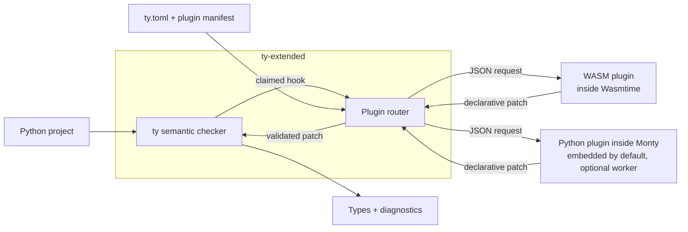

# ty-extended

[](https://pypi.org/project/ty-extended/)

A fork of [Astral's ty](https://github.com/astral-sh/ty) with support for semantic plugins.
It keeps the `ty` command and language server.

## Getting started

Run with [uvx](https://docs.astral.sh/uv/guides/tools/#running-tools):

```shell
uvx --from ty-extended ty check
```

Or add it to your project:

```shell
uv add --dev ty-extended
uv run ty check
```

## Plugins


```mermaid
flowchart LR
    subgraph host["ty-extended"]
        checker["ty semantic checker"] -->|claimed hook| router["Plugin router"]
        router -->|validated patch| checker
    end

    project["Python project"] --> checker
    config["ty.toml + plugin manifest"] --> router
    router -->|JSON request| wasm["WASM plugin<br/>inside Wasmtime"]
    wasm -->|declarative patch| router
    router -->|JSON request| monty["Python plugin inside Monty<br/>embedded by default, optional worker"]
    monty -->|declarative patch| router
    checker --> output["Types + diagnostics"]
```

- **Rust** plugins compile to WebAssembly and run in Wasmtime, using
    [`ty_plugin_sdk`](https://crates.io/crates/ty_plugin_sdk).
- **Python** plugins run in Monty, using the bundled `ty.plugin_sdk`. No compilation is needed.

Monty runs in-process by default, with no external runtime dependency. Separate
[worker processes](./docs/plugin-runtime.md#monty-worker-processes) are opt-in through the
`monty-workers` extra and project configuration.

Enable installed plugins in `ty.toml`:

```toml
[plugins]
auto-discover = true
```

## Existing plugins

- [`django-ty`](https://github.com/regularkevvv/django-ty): Django ORM type support
    ([PyPI](https://pypi.org/project/django-ty/)).

## Documentation

- [Installation](./docs/installation.md) and [editor setup](./docs/editors.md)
- [Plugin authoring](./docs/plugin-authoring.md) and [runtime configuration](./docs/plugin-runtime.md)
- [FAQ](./docs/faq.md) and [changelog](./CHANGELOG.md)
- [Upstream ty documentation](https://docs.astral.sh/ty/) for checker and typing features

Report fork or plugin issues in the [issue tracker](https://github.com/regularkevvv/ty-extended/issues).

## Contributing

Rust implementation changes belong in [ruff-extended](https://github.com/regularkevvv/ruff-extended),
which is pinned by the `ruff` submodule. See [CONTRIBUTING.md](./CONTRIBUTING.md).

## Version policy

Versions track the upstream ty base: `ty-extended 0.86.0` builds on `ty 0.0.86`, with fork-only
releases incrementing the patch. SDK and protocol crates are versioned independently; breaking
changes may occur between their pre-1.0 releases.

## License

MIT ([LICENSE](./LICENSE)).

Unless you explicitly state otherwise, any contribution intentionally submitted for inclusion in
ty by you, as defined in the MIT license, shall be licensed as above, without any additional terms
or conditions.
